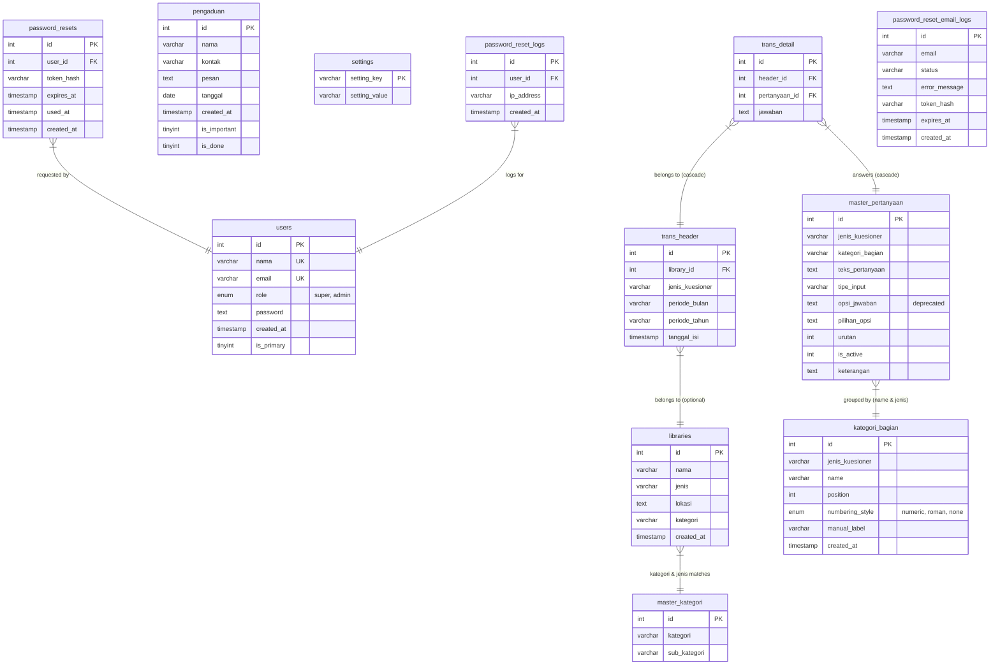

# Penjelasan Keadaan Sistem dan Detail Aplikasi
**Layanan Survei & Kotak Aspirasi Dinas Kearsipan & Perpustakaan Kabupaten Lombok Barat (DISARPUS LOBAR)**

Dokumen ini menyajikan analisis menyeluruh mengenai kondisi terkini, arsitektur sistem, skema database, katalog fitur, mekanisme keamanan, serta panduan estetika visual dari aplikasi **Royal GovTech DISARPUS LOBAR**.

---

## 🗺️ Entity-Relationship Diagram (ERD)

Berikut adalah struktur hubungan antar tabel (skema relasional) yang diimplementasikan pada database `monitoring_perpus_db`:



*Catatan: Tabel pemulihan kata sandi (`password_resets`, `password_reset_logs`, `password_reset_email_logs`) digunakan untuk menyimpan token reset password, log audit reset password, dan status pengiriman email pemulihan.*

---

## 🏛️ Arsitektur & Teknologi Utama

Sistem dikembangkan dengan arsitektur **MVC (Model-View-Controller) Clean Architecture** yang sangat efisien dan aman tanpa ketergantungan framework berat.

### 💻 Stack Teknologi
1. **Core Backend**: PHP 8.x Native (menggunakan OOP PDO dan struktur folder MVC yang terstruktur rapi).
2. **Database Engine**: MySQL / MariaDB (Storage Engine: InnoDB dengan integritas referensial kunci asing dan aksi `ON DELETE CASCADE`).
3. **Frontend Presentation**: HTML5, Vanilla CSS3 (Custom Responsive & Glassmorphism Tokens), Bootstrap 5.3 (Utility framework), JQuery (untuk pemrosesan AJAX yang ringan).
4. **Library & Integrasi Pihak Ketiga**:
   - **SweetAlert2**: Untuk tampilan dialog konfirmasi modern dan elegan.
   - **Select2 (Bootstrap 5 Theme)**: Untuk pencarian interaktif nama perpustakaan secara dinamis.
   - **Chart.js**: Render statistik grafik bulanan interaktif dan demografi pada dashboard admin.
   - **Brevo API Integration**: Pengiriman email pemulihan kata sandi admin secara transaksional.

---

## 📂 Struktur Berkas & Direktori Workspace

Workspace tersusun secara modular mengikuti pola desain Model-View-Controller (MVC) dengan pemisahan tegas antara logika aplikasi, tampilan, dan aset publik:

```
web-perpus-lobar/
├── .htaccess                 # Konfigurasi Apache tingkat root untuk mengamankan file sensitif & routing bersih
├── .gitignore                # File pengecualian Git
├── README.md                 # Petunjuk instalasi & dokumentasi singkat
├── currentState.md           # Keadaan sistem terkini (Dokumen ini)
├── database.sql              # Berkas eksport data SQL lengkap dengan skema & master data terbaru
├── index.php                 # Halaman penengah root yang secara otomatis mengalihkan akses ke public/
├── backup_legacy_pre_mvc.zip # Backup lokal dari file prosedural lama sebelum migrasi ke MVC (tidak ditrack git)
├── composer.json / lock      # Konfigurasi Composer dan dependensi PHP
├── robots.txt                # Panduan bagi web crawler/crawler mesin pencari
├── config/                   # Konfigurasi Inti Aplikasi & Middleware
│   ├── admin_auth.php        # Middleware keamanan admin, session timeout (30 menit), dan deteksi rewrite
│   ├── database.php          # Inisialisasi koneksi global database menggunakan PDO
│   ├── loader.php            # Templat loading spinner transisi halaman
│   ├── mail_config.php       # Konfigurasi rahasia API Key Brevo & email pengirim
│   ├── mailer.php            # Wrapper utilitas pengiriman email via Brevo API
│   ├── profanity.php         # Kamus kata-kata tidak sopan untuk sensor kotak pengaduan
│   └── public_security.php   # Keamanan CSRF publik & sistem proteksi rate limit
├── public/                   # Satu-satunya folder yang dapat diakses publik oleh server web
│   ├── .htaccess             # Aturan mod_rewrite Apache untuk menangani routing bersih lewat index.php
│   ├── index.php             # Front Controller (Entry point utama aplikasi)
│   └── assets/               # Aset Statis Publik (CSS, JS, & Gambar)
│       ├── admin-readability.css  # CSS pembantu keterbacaan teks admin
│       ├── admin-responsive.css   # CSS responsivitas layout dashboard admin
│       ├── govtech.css            # Desain sistem warna utama Royal GovTech
│       ├── loader.css / js        # Gaya visual & script animasi memuat halaman
│       ├── logo_disarpus.png      # Logo instansi DISARPUS
│       ├── logo_lobar.png         # Logo Kabupaten Lombok Barat
│       └── public-responsive.css  # CSS responsivitas kuesioner publik
├── app/                      # Logika Inti Pola MVC
│   ├── Core/                 # Berkas Sistem Utama
│   │   ├── App.php           # Router utama pengolah URL request (Front Controller helper)
│   │   ├── Controller.php    # Base Controller (menyediakan method view, model, & dynamic redirect)
│   │   └── Database.php      # Driver Database Wrapper berbasis PDO dengan support transaksi
│   ├── Controllers/          # Logika Pengendali Request (Controllers)
│   │   ├── AdminController.php      # Controller panel admin & manajemen data
│   │   ├── AuthController.php       # Controller login/logout admin & pemulihan password (forgot/reset)
│   │   ├── HomeController.php       # Controller landing page utama publik
│   │   └── PustakawanController.php # Controller pengisian kuesioner & form pengaduan
│   ├── Models/               # Interaksi Data Database (Models)
│   │   ├── ComplaintModel.php       # Model pengaduan & aspirasi
│   │   ├── DashboardModel.php       # Model untuk agregasi grafik & statistik dashboard
│   │   ├── LibraryModel.php         # Model manajemen instansi perpustakaan
│   │   ├── QuestionModel.php        # Model kuesioner & pertanyaan
│   │   ├── SettingModel.php         # Model konfigurasi aplikasi
│   │   └── UserModel.php            # Model manajemen akun pengguna
│   └── Views/                # Berkas Presentasi (Views / HTML)
│       ├── admin/            # Kumpulan tampilan antarmuka admin (termasuk login, forgot_password, & reset_password)
│       ├── home/             # Tampilan halaman beranda utama
│       └── pustakawan/       # Tampilan pengisian survei & form pengaduan
```

---

## 🌟 Inventaris Fitur & Fungsionalitas Aplikasi

### 1. Portal Publik & Pengisian Kuesioner (`app/Views/pustakawan/` & `app/Views/home/`)
- **Peta Identitas Perpustakaan (`pilih_perpustakaan.php`)**: Alur berjenjang (Jenis Utama $\rightarrow$ Sub Jenis $\rightarrow$ Cari Nama Perpustakaan) dengan Select2 interaktif. Mencegah kesalahan ketik (typo) nama instansi oleh responden.
- **Formulir Kuesioner Dinamis (`render_kuesioner.php`)**:
  - Mengambil data pertanyaan langsung dari database sesuai jenis survei (IPLM / TKM).
  - Mengelompokkan otomatis pertanyaan ke dalam panel seksi (`section-card`) berdasarkan `kategori_bagian`.
  - **Peta Navigasi Soal (Minimap)**: Menampilkan status keterisian pertanyaan. Dot hijau menandakan terisi, dot biru menandakan aktif, dot abu-abu menandakan kosong. Memungkinkan loncat navigasi instan (`jumpTo`) ke pertanyaan tertentu.
  - **Auto-Scroll & Keyboard Focus**: Setelah memilih opsi (radio/likert) atau menekan Enter di kolom teks, sistem otomatis melakukan gulir halus (smooth scroll) ke pertanyaan berikutnya.
  - **Draft Persistence (`localStorage`)**: Jawaban tersimpan otomatis di browser secara berkala. Jika internet terputus atau tab tertutup tidak sengaja, jawaban tidak akan hilang saat dimuat kembali.
  - **Penomoran Dinamis**: Penomoran bab dan butir pertanyaan menggunakan gaya penomoran global dari database (Angka, Romawi, atau Tanpa Nomor).
- **Kotak Aspirasi / Pengaduan (`form_pengaduan.php`)**: Portal pengaduan resmi terintegrasi dengan filter kata-kata kasar.

### 2. Panel Administrator (`app/Views/admin/`)
- **Dashboard Analitis (`dashboard.php`)**:
  - Ringkasan total responden bulanan, jumlah instansi yang sudah berpartisipasi, dan yang belum berpartisipasi.
  - Grafik tren bulanan IPLM & TKM interaktif berbasis Chart.js.
  - **Grafik Demografi**: Menampilkan data statistik persebaran responden secara visual di dashboard.
  - **Penjadwalan Kuesioner Otomatis**: Fitur buka/tutup survei secara otomatis berdasarkan rentang tanggal dan jam terprogram, atau dialihkan ke mode manual secara instan.
- **Manajemen Perpustakaan (`perpustakaan.php`)**:
  - Tambah, ubah, dan hapus instansi perpustakaan secara live (AJAX-based search).
  - **Reset Status Pengisian**: Membatalkan status pengisian instansi tertentu untuk bulan berjalan jika terjadi kesalahan pengisian (menggunakan transaksi DB terisolasi).
  - **Impor Massal Instansi**: Unggah data ribuan perpustakaan instan menggunakan file CSV dengan pembatas dinamis (koma `,` atau titik koma `;`) dan validasi duplikasi ketat.
- **Manajemen Kuesioner (`atur_pertanyaan.php`)**:
  - Menambah seksi/bagian kuesioner lengkap dengan pengaturan posisinya secara drag-less splice.
  - Menambah dan mengubah pertanyaan satu per satu atau **mengunggah massal via CSV**.
  - **Auto-Order Refresh**: Menjaga urutan pertanyaan selalu berurutan (tanpa lubang nomor urut) per seksi kuesioner. Jika satu soal dihapus atau urutannya disisipkan di tengah, sistem akan menyesuaikan nomor urutan lainnya secara otomatis.
  - **Auto-Fill Config**: Memetakan id pertanyaan tertentu untuk jenis, sub-jenis, dan nama perpustakaan agar terisi otomatis saat responden membuka formulir kuesioner IPLM.
- **Manajemen Hasil Kuesioner (`hasil_kuisioner.php`)**:
  - Rekapitulasi tabulasi dinamis seluruh jawaban responden.
  - **Ekspor Excel Profesional**: Menghasilkan file excel tabulasi komplit dengan baris jawaban responden per butir soal untuk diolah lebih lanjut.
- **Manajemen Pengaduan (`pengaduan.php`)**:
  - Menandai laporan pengaduan penting (pin ke atas) atau menandainya selesai diproses.
- **Manajemen Pengguna (`users.php`)**:
  - Pembatasan hak akses berbasis peran (Super Admin vs Admin Standar). Super Admin dapat mengelola akun admin lain.
  - **Proteksi Log Email**: Manajemen data log historis di tab konfigurasi pengguna.

---

## 🔒 Sistem Keamanan Hardening & Validasi

Aplikasi ini telah melewati fase audit dan pengerasan keamanan (Security Hardening) tingkat tinggi:

1. **Proteksi CSRF (Cross-Site Request Forgery)**:
   - Token CSRF acak unik dihasilkan per sesi untuk admin (`config/admin_auth.php`) maupun publik (`config/public_security.php`).
   - Setiap permintaan POST divalidasi ketat menggunakan fungsi pembanding tahan-waktu (`hash_equals`).
2. **Rate Limiting Anti Brute Force / DDoS**:
   - Limit pengiriman kuesioner dibatasi maksimal **20 kali per jam** per alamat IP.
   - Limit pengiriman kotak aspirasi dibatasi maksimal **5 kali per jam** per alamat IP.
   - Menggunakan mekanisme file-locking (`LOCK_EX`) terenkripsi untuk mencegah race conditions saat pencatatan rate limit.
3. **Penyaringan Konten Kasar (Profanity Filter)**:
   - Seluruh input pengaduan dipindai menggunakan kamus ekspresi reguler (`config/profanity.php`).
   - Kata-kata kasar/umpatan disensor otomatis menjadi `***` sebelum masuk ke database, dengan pemberitahuan edukatif yang sopan kepada pengirim.
4. **Validasi Anti Duplikasi Ganda (IPLM)**:
   - **Duplikasi Instansi**: Unit perpustakaan yang sama tidak diperkenankan mengisi formulir IPLM lebih dari satu kali pada bulan dan tahun periode berjalan.
   - **Duplikasi Kontak Pengisi**: Kontak pengisi (Nomor HP/WhatsApp/Email) yang sama tidak boleh digunakan untuk mengisi IPLM pada perpustakaan yang berbeda dalam bulan/tahun berjalan. Nomor telepon dinormalisasi terlebih dahulu dengan menghapus semua karakter non-angka agar pendeteksian duplikat tetap akurat meski format penulisannya berbeda (misal: `081...`, `+6281...`, `62-81...`).
5. **Session Security & Timeout**:
   - Sesi administrator otomatis dihancurkan (`session_destroy`) jika tidak terdeteksi adanya aktivitas (idle) selama **30 menit** berturut-turut untuk mencegah pembajakan sesi di komputer bersama.
6. **Perlindungan Hak Akses Utama (Primary Admin protection)**:
   - Akun Super Admin pertama bertindak sebagai "Primary Admin" (`is_primary = 1`).
   - Akun ini terlindungi secara permanen dari upaya penghapusan, penggantian email, maupun penurunan peran (demotion) oleh admin super lainnya.
7. **Pencegahan Kebocoran Database (Safe DB Log)**:
   - Pesan kesalahan (SQL error) diisolasi total dari pengguna publik. Sistem hanya menampilkan pesan ramah umum, sedangkan pesan kesalahan teknis dicatat di server log privat menggunakan `error_log()`.

---

## 🎨 Panduan Estetika Visual (Royal GovTech)

Antarmuka dirancang menggunakan filosofi **Royal GovTech UI** yang elegan, berwibawa, namun terasa sangat modern dan interaktif:

### 🎨 Palet Warna Kurasi
- **Primary Color**: `#0F52BA` (Royal Blue) $\rightarrow$ Mewakili wibawa kepemerintahan dan kepercayaan publik.
- **Primary Dark**: `#0a3d8f` (Deep Cobalt) $\rightarrow$ Memberikan kontras mendalam untuk teks tajam.
- **Accent Color**: `#334155` (Slate Gray) $\rightarrow$ Memberikan kesan tenang pada navigasi sekunder.
- **Background Slate**: `#f8fafc` $\rightarrow$ Latar belakang bersih yang meminimalkan kelelahan mata.
- **Border Utility**: `#e2e8f0` $\rightarrow$ Garis pembatas tipis yang memberikan struktur rapi tanpa terlihat kaku.

### ✨ Karakteristik UI & Efek Visual
- **Glassmorphism Premium**: Penggunaan latar belakang semi-transparan `rgba(255, 255, 255, 0.9)` berpadu dengan efek blur kaca `backdrop-filter: blur(12px)` pada kartu portal utama.
- **Pola Geometris Dinamis**: Latar belakang dihiasi gradasi lingkaran radial tipis (`radial-gradient`) dikombinasikan dengan garis grid transparan 40px, menciptakan ilusi kedalaman visual yang memukau.
- **Tipografi Modern**: Sepenuhnya menggunakan font **Plus Jakarta Sans** (Google Fonts) dengan penataan ketebalan ekstrim (`font-weight: 800`) untuk penekanan tajam judul halaman.
- **Aksentuasi Tombol**: Tombol tindakan utama menggunakan gradasi linear `linear-gradient(135deg, var(--primary) 0%, var(--primary-dark) 100%)` berhias bayangan lembut (`box-shadow`), serta efek mikro-interaksi melayang (hover translate-Y -2px).

---

## 📈 Kondisi Terkini & Kesimpulan Proyek

Aplikasi **Layanan Survei & Kotak Aspirasi DISARPUS LOBAR** saat ini telah bermigrasi sepenuhnya ke arsitektur **MVC (Model-View-Controller)** yang rapi, modern, dan modular. Fitur pemulihan kata sandi admin (Lupa & Reset Password) telah berhasil diimplementasikan ulang di bawah arsitektur MVC menggunakan integrasi Brevo API v3 secara aman. Berkas prosedural lama yang tidak terpakai telah dibersihkan secara permanen dari Git, dengan cadangan lokal disimpan aman di `backup_legacy_pre_mvc.zip`.

Sistem siap dihosting pada server produksi Dinas Kearsipan & Perpustakaan Lombok Barat dengan kinerja andal, struktur kode profesional, dan standar keamanan tertinggi.
